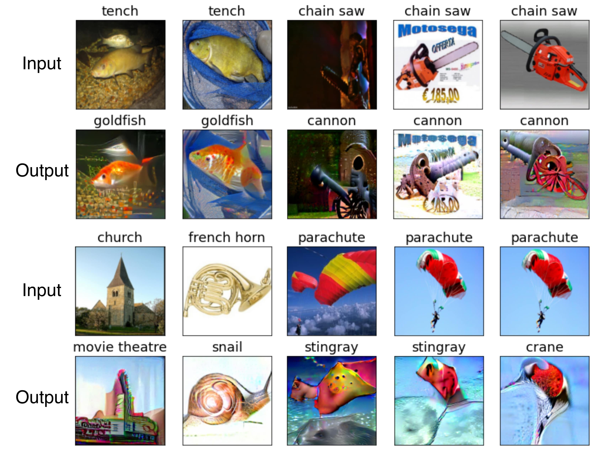

## Exploring Image Synthesis Using A Robust Classifier

### Francesco Mastrocinque, Owen Gibson     

#### fam21@duke.edu, ogg4@duke.edu

[Paper PDF](main_compressed.pdf)

<table>
<colgroup>
<col style="width: 100%" />
</colgroup>
<tbody>
<tr class="odd">
<td style="text-align: left;">This work explores the impact of seed image distribution and classifier robust- ness on challenging tasks in image synthesis. Our approach utilizes a non-robust, ResNet50 model as a benchmark classifier and explores an adversarially robust ResNet50 model for image generation. Our findings demonstrate that the adver- sarially robust classifier greatly outperforms the benchmark classifier for image generation. The results described herein also explore other use cases of the robust classifier involving image inpainting, image super-resolution, and image-to-image translation..</td>
</tr>
<tr class="even">
<td style="text-align: left;">Paper:
<ul>
<li><a href="main_compressed.pdf">Paper PDF</a></li>
</ul></td>
</tr>
<tr class="odd">
<td style="text-align: left;">Dataset: <a href="https://github.com/fastai/imagenette">Link To Dataset</a></td>
</tr>
<tr class="even">
<td style="text-align: left;">Robust Model: <a href="https://github.com/MadryLab/robustness_applications">Link To Robust Model</a></td></tr>
</tbody>
</table>
